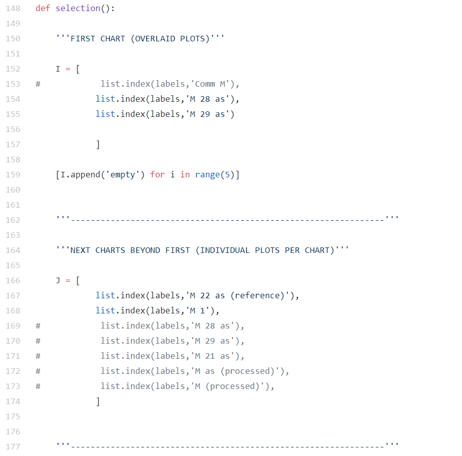
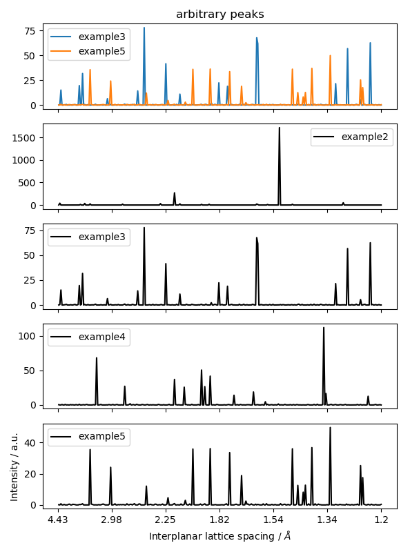

# X-Ray Diffraction (XRD) analysis with Python
#### Andrew Garcia, 2018

## XRD.py [and XRD_functions.py]
XRD.py integrates the XRD_functions.py script. Capabilities:

- [x] Import XRD data expressed as *.csv* files. Major improvement in csvfiles loading algorithm (processes everything in less than a couple of seconds):

- [x] Background subtraction on XRD data

- [x] Data smoothing (n-point moving average)

- [x] *Plots*: Figure generated can be customized to contain one graph with overlaid XRD plots (nplots = 1) or multiple plots in separate "n" graphs (nplots = n)

- [x] User-friendly data selection for plots in overlaid and individual charts

- [x] Ordinate units: **degrees**, 2-theta (xaxis_units = '') or **interplanar spacing**, Angstroms (xaxis_units = 'braggs')

- [x] Crystallite size calculation for each XRD file
Scherrer equation [displayed on shell].

- [x] Emission peaks: Location of emission peaks corresponding to secondary radiation sources (with K_alpha peak as a reference)

## XRDsingle.py

- [x] Import XRD file expressed as *.csv* files:

- [x] Background subtraction on XRD data

- [x] *Plots*: background subtracted and non-subtracted shown in figure

- [x] Creates *.csv* file of background-subtracted version of XRD data. .csv files can be opened and edited in Excel (if Excel is your thing)

## indexing.py

- [x] Interplanar spacing calculation by Braggs' law

- [ ] Determination of hkl indices and lattice parameters for powder patterns

- [ ]  ~~If your a b c lattice parameters are known, can be used to find the Miller indices of your XRD data at a certain 2-theta peak [HARD]~~

## LICENSE file excerpt -see: LICENSE file in this repository-

   Copyright 2018 Andrew R Garcia

   Licensed under the Apache License, Version 2.0 (the "License");
   you may not use this file except in compliance with the License.
   You may obtain a copy of the License at

       http://www.apache.org/licenses/LICENSE-2.0

   Unless required by applicable law or agreed to in writing, software
   distributed under the License is distributed on an "AS IS" BASIS,
   WITHOUT WARRANTIES OR CONDITIONS OF ANY KIND, either express or implied.
   See the License for the specific language governing permissions and
   limitations under the License.
